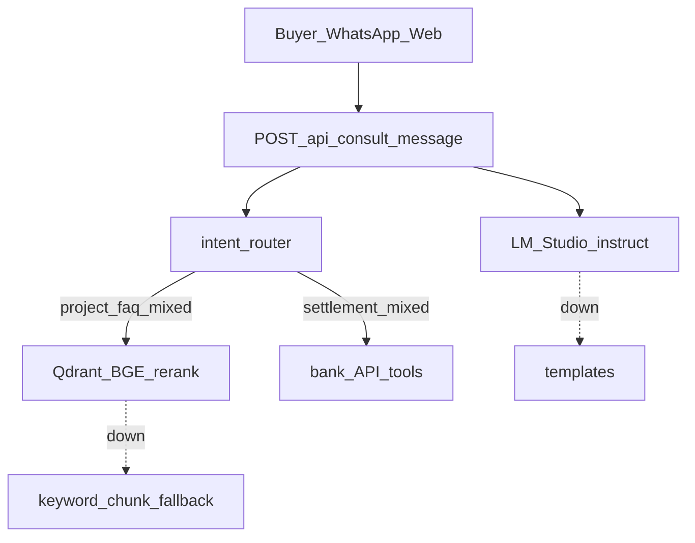

# Consult Knowledge Demo

Two-layer consultation for hackathon booth — **full RAG contour** when services are up, **keyword fallback** when down.

## Layers

| Layer | Source | When used |
|-------|--------|-----------|
| **Project sales** | `data/consult_knowledge/realestate-demo/` (Landmark Sukhumvit Tower KB) + Qdrant ingest | Price, FET, installments, Bangkok tier-1 inventory |
| **Bank settlement** | Synthetic API tools (developer hub, scenarios, supplier contrast) | Payee, escrow, SWIFT/USDT/cash, Closing Passport |



## Retrieval modes

Set `CONSULT_RETRIEVAL_MODE` in `.env` or Docker compose:

| Env value | Pipeline |
|-----------|----------|
| `auto` (default) | RAG → keyword fallback |
| `rag` | RAG only |
| `keyword` | In-memory chunk search only |

## Corpus (Landmark Sukhumvit)

Synthetic consult KB aligned with [`bangkok-landmark-feed.json`](../data/synthetic/developers/bangkok-landmark-feed.json):

- **7 markdown files** — Project_Overview, FAQ, Sales_Process, Legal_and_Terms, Buyer_Settlement_Bridge, FAQ_TH, README
- **Single demo inventory** — 2BR from 18.5M THB, 3BR from 24.8M THB
- **No CSV / no RealEstate-AI import** — slim corpus for WhatsApp distribution demo

After KB edits, ingest into Qdrant (includes synthetic + consult KB):

```bash
curl -X POST http://localhost:8080/api/rag/ingest
```

## API

```bash
curl http://localhost:8080/api/consult/knowledge/healthz
curl http://localhost:8080/api/consult/contour/healthz
curl -X POST http://localhost:8080/api/consult/message \
  -H 'Content-Type: application/json' \
  -d '{"session_id":"demo","message":"Ку","channel":"web"}'
curl -X POST http://localhost:8080/api/consult/message \
  -H 'Content-Type: application/json' \
  -d '{"session_id":"demo","message":"сколько стоит квартира и FET?","channel":"web"}'
curl -X POST http://localhost:8080/api/consult/message \
  -H 'Content-Type: application/json' \
  -d '{"session_id":"demo","message":"payee mismatch escrow deposit","channel":"web"}'
```

## Intent routing

| Intent | Example | Tools |
|--------|---------|-------|
| `greeting` | «Ку», «Hi» | Welcome only (RU/EN/TH) |
| `project_faq` | «цена квартира», «FET visa» | `consult_rag_search` or `consult_knowledge_search` |
| `settlement` | «payee deposit SWIFT» | developer hub, scenarios + policy RAG |
| `mixed` | Both domains | Both layers |

## WhatsApp demo prompts (RU / EN)

**RU:** «Привет» → «Сколько стоят квартиры?» → «Что такое FET?» → «Можно ли депозит на payee агента?»

**EN:** «Hello» → «What is the ROI?» → «Payee mismatch on escrow?»

## Voice / ASR (roadmap — not live)

Inbound WhatsApp voice notes can be routed:

```text
voice note → ASR (Whisper, LOCAL_AI_ASR_BASE_URL) → text → /api/consult/message → reply
```

Remote ASR service documented in project skills (Linux GPU via TailScale). **Not enabled** in hackathon MVP — text-only today; pitch: *24/7 multilingual text now; voice one env flag away*.

## Distribution channels

Buyer consult is a **distribution surface** for bank rules — not a parallel payment authority. WhatsApp, web, and API call the same endpoint today; Telegram, Line, email, and voice are roadmap adapters on the same contract. See [`DISTRIBUTION_CHANNELS.md`](DISTRIBUTION_CHANNELS.md).

## Dialogue simulation

Regression scripts for multi-turn buyer chat (intent, RAG scope, no synthetic project leak):

```bash
# Offline — CI-safe, LLM mocked (template path)
cd apps/api && uv run python ../../scripts/run_consult_dialogue_matrix.py --offline

# Live — Docker API + LM Studio (natural phrasing review)
uv run python scripts/run_consult_dialogue_matrix.py --api-url http://localhost:8080
```

Report: [`CONSULT_DIALOGUE_SIMULATION_REPORT.md`](CONSULT_DIALOGUE_SIMULATION_REPORT.md) · fixtures: [`data/consult_dialogues/dialogue_matrix.yaml`](../data/consult_dialogues/dialogue_matrix.yaml).

## Pitch (60 sec)

> Buyer writes on WhatsApp. Project questions: Qdrant + BGE over **Landmark Sukhumvit Tower** consult_kb (Bangkok tier-1). Money questions: deterministic bank API + policy RAG. LM Studio answers in the buyer's language — facts only, no payment approval. If any service is down, logged explicit fallback.

## Related

- [`LOCAL_AI_CONTOUR.md`](LOCAL_AI_CONTOUR.md) — full stack runbook
- [`WHATSAPP_CONSULT_DEMO.md`](WHATSAPP_CONSULT_DEMO.md) — QR pairing
- [`DISTRIBUTION_CHANNELS.md`](DISTRIBUTION_CHANNELS.md) — multi-channel adapters
