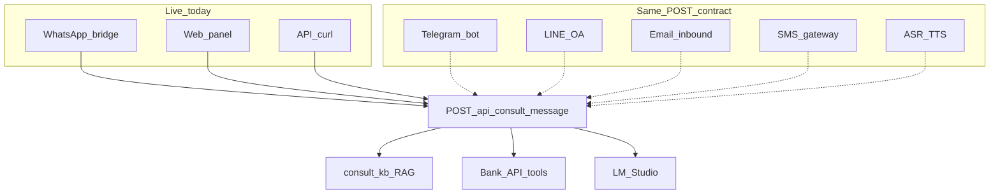

# Distribution Channels — Buyer Consultation

One consult brain, many adapters. Settlement authority stays on bank rules — channels are **distribution only**.

## Architecture



## API contract

```bash
curl -X POST http://localhost:8080/api/consult/message \
  -H 'Content-Type: application/json' \
  -d '{"session_id":"user-123","message":"payee mismatch","channel":"web"}'
```

| Field | Purpose |
|-------|---------|
| `session_id` | Multi-turn context (required) |
| `message` | User text |
| `channel` | `web` \| `whatsapp` \| `telegram` \| `line` \| `email` \| `voice` (metadata) |

Response includes `intent`, `retrieval_mode`, `citations[]`, `tools_used[]` — same for all channels.

## Live channels

| Channel | Setup |
|---------|--------|
| **Web** | `apps/web` buyer consultation panel |
| **WhatsApp** | [`WHATSAPP_CONSULT_DEMO.md`](WHATSAPP_CONSULT_DEMO.md) — `:8020` bridge |
| **HTTP/API** | Direct POST for integrations and smoke tests |

## Roadmap channels (thin adapters)

Each adapter: receive message → `POST /api/consult/message` → send reply. No duplicate RAG or LLM logic.

| Channel | Typical integration | Thailand note |
|---------|---------------------|---------------|
| **Telegram** | Bot API webhook | Foreign buyers, expat communities |
| **LINE** | Messaging API / LIFF | Primary local messenger |
| **Email** | IMAP or inbound webhook | Bank-grade audit trail |
| **SMS** | Twilio / local gateway | OTP + short consult links |
| **Voice** | ASR → text → consult; optional TTS reply | See voice section below |

Policy stub: [`data/synthetic/policies/consult_channel_policy.md`](../data/synthetic/policies/consult_channel_policy.md)

## Voice (ASR / TTS)

```text
voice note → ASR (Whisper / LOCAL_AI_ASR_BASE_URL) → text
          → POST /api/consult/message (channel=voice)
          → optional TTS → audio reply
```

Not enabled in hackathon MVP — same consult API; one env flag away. See [`CONSULT_KNOWLEDGE_DEMO.md`](CONSULT_KNOWLEDGE_DEMO.md).

## Pitch line (15 sec)

> WhatsApp is live today for booth demo. Telegram, LINE, email, and voice use the **same consult API** — banks keep one settlement brain; channels are how buyers reach it.

## Related

- [`BUYER_CONSULTATION_AGENT.md`](BUYER_CONSULTATION_AGENT.md)
- [`LOCAL_AI_CONTOUR.md`](LOCAL_AI_CONTOUR.md)
- [`CONSULT_KNOWLEDGE_DEMO.md`](CONSULT_KNOWLEDGE_DEMO.md)
- [`HACKATHON_RUNBOOK.md`](HACKATHON_RUNBOOK.md)
