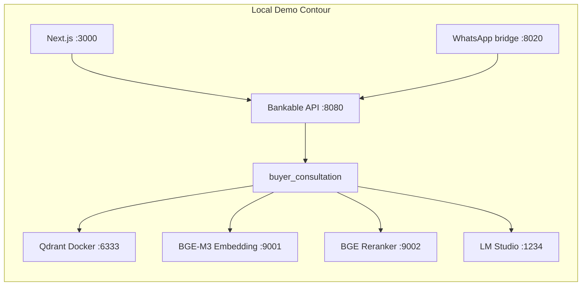

# Local AI Contour — Hackathon Demo

Bankable Property Network demo runs in a **controlled local contour** on MacBook: Docker Qdrant, local BGE embedding/reranker services, optional LM Studio for LLM explainability.

For production scale and bank-grade SLA, see [`AI_SERVICE_TIERS.md`](AI_SERVICE_TIERS.md).

## Architecture



**Important:** Money-movement decisions remain **deterministic rules** in the MVP. RAG retrieves evidence; **LM Studio** explains buyer-facing answers when configured. Consult never approves deposits — bank rules and scenarios decide settlement paths.

## Prerequisites

| Component | Purpose |
|-----------|---------|
| Docker | Qdrant vector store |
| uv + Python 3.12 | FastAPI backend |
| pnpm + Node 20+ | Next.js demo UI |
| BGE Embedding service | `BAAI/bge-m3` on `:9001` (Apple MPS or CPU) |
| BGE Reranker service | `BAAI/bge-reranker-v2-m3` on `:9002` |
| LM Studio | Local instruct model, OpenAI-compatible server on `:1234` |

Copy env:

```bash
cp .env.example .env
```

## Start order

### 1. Qdrant (Docker)

```bash
docker compose -f infra/docker-compose.yml up -d qdrant
curl http://localhost:6333/collections
```

### 2. BGE services

Start embedding and reranker via your local BGE runtime (e.g. Services-BGE `service.sh` or equivalent).

Smoke:

```bash
curl http://localhost:9001/healthz
curl http://localhost:9002/healthz
```

### 3. LM Studio (optional for demo narrative)

1. Load a small **instruct** model suitable for schema-bound summaries.
2. Enable **Local Server** → OpenAI-compatible API.
3. Default base URL: `http://localhost:1234/v1`
4. Set `LOCAL_AI_LLM_INSTRUCT_BASE_URL=http://localhost:1234/v1` in `.env`

Note: buyer consult **calls** LM Studio when `LOCAL_AI_LLM_INSTRUCT_BASE_URL` is set. **Qwen 3.6** (thinking model) works with `LOCAL_AI_LLM_ENABLE_THINKING=false` (default) — answers go to `content`, not hidden reasoning. Keep the model loaded in LM Studio; `LOCAL_AI_LLM_INSTRUCT_MODEL=local-model` uses whatever is active.

### 4. Buyer agent (roadmap)

Future `apps/buyer-agent/` — LangGraph.js service using `LOCAL_AI_LLM_INSTRUCT_BASE_URL`. Smoke when implemented:

```bash
curl http://localhost:3001/healthz
```

### 5. API

```bash
cd apps/api
uv sync
uv run uvicorn app.main:app --app-dir src --host 0.0.0.0 --port 8080
```

### 6. Web

```bash
cd apps/web
pnpm install
pnpm dev
```

## RAG smoke

```bash
curl http://localhost:8080/api/rag/health
curl -X POST "http://localhost:8080/api/rag/ingest?dry_run=true"
curl -X POST http://localhost:8080/api/rag/ingest
curl "http://localhost:8080/api/scenarios/usdt-mixed-route/rag-run"
curl "http://localhost:8080/api/scenarios/usdt-mixed-route/rag-run?mode=fallback"
```

Expected modes:

| Mode | Meaning |
|------|---------|
| `qdrant_embedding_reranker` | Live: Qdrant + BGE embed + BGE rerank |
| `deterministic_fallback` | Explicit fallback when services unavailable |

## Consult contour smoke

```bash
./scripts/start-full-ai-contour.sh
curl http://localhost:8080/api/consult/contour/healthz
curl -X POST http://localhost:8080/api/consult/message \
  -H 'Content-Type: application/json' \
  -d '{"session_id":"contour","message":"сколько стоит квартира FET","channel":"web"}'
```

Consult retrieval modes (`CONSULT_RETRIEVAL_MODE`):

| Mode | Behavior |
|------|----------|
| `auto` | Qdrant + BGE + rerank; keyword chunk fallback when services down |
| `rag` | Live RAG only (raises if unavailable) |
| `keyword` | In-memory consult KB only (no Qdrant) |

Response `retrieval_mode`: `llm_instruct` | `rag_llm` | `keyword_template` | `deterministic_template` | `greeting_template`.

## Fallback policy

Never silent degradation. If Qdrant or BGE is down in `auto` mode, API returns `retrieval_mode: deterministic_fallback` with `retrieval_fallback_reason` logged and exposed in Scenario Simulator.

For presenter rehearsal without AI stack:

```bash
curl "http://localhost:8080/api/scenarios/swift-clean-route/rag-run?mode=fallback"
```

## Environment variables (demo tier)

```bash
QDRANT_URL=http://localhost:6333
LOCAL_AI_EMBEDDING_BASE_URL=http://localhost:9001
LOCAL_AI_RERANKER_BASE_URL=http://localhost:9002
LOCAL_AI_LLM_INSTRUCT_BASE_URL=http://localhost:1234/v1
CONSULT_RETRIEVAL_MODE=auto
BANKABLE_AI_TIER=demo_local
```

## Presenter one-liner

> Today we run a controlled local contour: Docker Qdrant, BGE on MacBook, LM Studio for explainability prototypes. Money decisions stay on deterministic rules. For a bank pilot with thousands of concurrent users, inference moves to **vLLM** and embeddings to **Qwen-class** models — not desktop LM Studio.

## Expand (post-hackathon)

- Scaffold `apps/buyer-agent/` — LangGraph.js buyer consultation graph (see [`REPRODUCTION_GUIDE.md`](REPRODUCTION_GUIDE.md) Phase J).
- Wire LM Studio / vLLM gateway for schema-bound compliance memos (`POST /v1/chat/completions` + Pydantic output schema).
- Hybrid retrieval: BGE sparse + dense in Qdrant.
- Per-tenant collections for multi-developer feeds.
- Observability: latency, fallback rate, embedding model version in `/api/rag/health`.

## Related

- [`AI_SERVICE_TIERS.md`](AI_SERVICE_TIERS.md) — demo vs enterprise matrix
- [`BUYER_CONSULTATION_AGENT.md`](BUYER_CONSULTATION_AGENT.md) — buyer agent local runtime
- [`NONLINEAR_DECISION_GRAPH.md`](NONLINEAR_DECISION_GRAPH.md) — settlement branch graph
- [`REAL_RAG_DEMO.md`](REAL_RAG_DEMO.md) — RAG commands and interpretation
- [`DISTRIBUTION_CHANNELS.md`](DISTRIBUTION_CHANNELS.md) — multi-channel consult adapters
