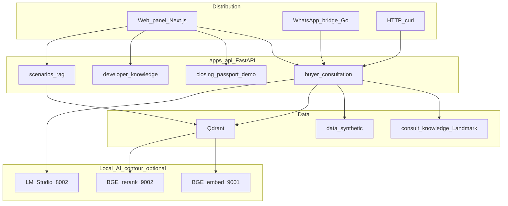

# Project Audit Report — Bankable Property Network

> **Audit date:** 2026-05-20 · **API version:** 0.5.13 (post-audit doc sync) · **Data:** synthetic demo only

Single authoritative audit artifact. For session continuity see [`HANDOFF.md`](HANDOFF.md). For AI/hackathon reviewers see [`AI_AUDIT_INDEX.md`](AI_AUDIT_INDEX.md).

---

## 1. Executive summary

Bankable Property Network is a **late hackathon MVP / pre-booth polish** stage: bank-first settlement infrastructure with a working FastAPI + Next.js demo, eight scenario paths, live RAG contour, and multi-channel buyer consultation (web + WhatsApp).

| Metric | Value |
|--------|-------|
| Version | 0.5.12 → **0.5.13** (doc audit) |
| pytest | **64 passed** |
| Dialogue matrix | **17/17** (9 scripts, offline keyword mode) |
| RAG corpus | **46 documents** (39 synthetic + 7 consult_kb) |
| API routes | **18** |
| Scenario branches | **8** |

**Top 5 gaps for a “serious” demo:**

1. **Doc drift** — several Tier A docs lagged at v0.5.10 (resolved in 0.5.13 sync).
2. **PitchScreen static** — outcomes/roadmap hardcoded in web; not API-driven.
3. **Settlement Branch Explorer UI** — spec only; no parallel route panel.
4. **Consult transparency** — judges don’t see `retrieval_mode` / citations prominently in web panel.
5. **Deploy / vitrine** — scanovich.ai API + web deploy not guaranteed in repo state.

**Where we are on roadmap:** [PRODUCTION_ROADMAP.md](PRODUCTION_ROADMAP.md) **Phase 1 (24h hackathon demo) complete and exceeded**. Sprints 1–5 of [NEXT_IMPLEMENTATION_SPRINTS.md](NEXT_IMPLEMENTATION_SPRINTS.md) largely done. Sprint 6 (LangGraph) and Sprint 7 (Branch Explorer UI) not started.

---

## 2. Tier 0 sources and conflict rules

| Priority | Source | Role |
|----------|--------|------|
| 0 | `HANDOFF.md`, `AGENTS.md`, `CHANGELOG.md` | Version, verification, next work |
| 1 | `apps/api/src/app/main.py`, `config.py` | API contract ground truth |
| 2 | `dialogue_matrix.yaml`, generated simulation reports | Regression contract |
| 3 | Tier A in `DOCS_AUDIT.md` | Must match Tier 0 |
| D | `DEMO_REHEARSAL_REPORT.md`, `STAFF_REVIEW_0.5.4.md` | Historical only |

**Conflict rule:** code + HANDOFF + this report > stale Tier A > Tier D.

---

## 3. System map



### Infra (`infra/docker-compose.yml`)

| Service | Port | Notes |
|---------|------|-------|
| qdrant | 6333 | Vector store |
| bankable-api | 8080 | FastAPI + data mount |
| whatsapp-bridge | 8020 | whatsmeow → consult API |

**Not in compose:** `apps/web` (run locally with `pnpm dev`).

---

## 4. API capability matrix

| Route | Service | Data source | Tests | Degraded mode |
|-------|---------|-------------|-------|---------------|
| `GET /healthz` | main | — | test_api | — |
| `GET /api/demo/closing-passport` | closing_passport_demo | anchor case + synthetic | test_closing_passport | 503 DataLoadError |
| `GET /api/demo/guided-simulation` | inline main | closing + artifacts | test_api | 503 |
| `GET /api/demo/developer-knowledge-hub` | developer_knowledge | siam-riverside-feed | test_developer_knowledge | 503 |
| `GET /api/demo/supplier-contrast` | supplier_contrast_demo | landmark + shadow feeds | test_supplier_contrast | 503 |
| `GET /api/demo/post-closing-yield-plan` | yield_plan | synthetic | test_api | 503 |
| `GET /api/demo/evidence-pack` | evidence_pack | closing passport | test_api | 503 |
| `GET /api/scenarios` | scenarios | scenarios.json | test_api | 503 |
| `GET /api/scenarios/{id}/run` | scenarios | scenarios.json | test_api | 503 |
| `GET /api/scenarios/{id}/rag-run` | rag | Qdrant + fallback | test_rag | explicit fallback query param |
| `POST /api/rag/ingest` | rag | synthetic + consult_kb | test_rag | dry_run |
| `GET /api/consult/*` | consult_* | mixed | test_consultation | keyword/template/purchase_pitch fallback |
| `POST /api/consult/message` | buyer_consultation | RAG + bank tools + optional LLM | test_consultation | purchase_pitch_template on leak |

---

## 5. Web UI wiring

| Panel | API | Status |
|-------|-----|--------|
| PitchScreen | Static hardcoded | Gap — not API-driven |
| Anchor cards, footer steps | Static | May drift from HANDOFF |
| SupplierContrastDemo | `/api/demo/supplier-contrast` | Live |
| DeveloperKnowledgeHub | `/api/demo/developer-knowledge-hub` | Live |
| ClosingPassportPanel | `/api/demo/closing-passport` | Live |
| PostClosingYieldPlan | `/api/demo/post-closing-yield-plan` | Live |
| GuidedDealSimulation | `/api/demo/guided-simulation` | Live |
| ScenarioSimulator | `/api/scenarios`, rag-run | Live |
| BuyerConsultationPanel | `POST /api/consult/message` | Live — citations/mode not prominent |

---

## 6. Data corpus inventory

### Synthetic (`data/synthetic/`)

| Area | Count / files | Role |
|------|---------------|------|
| Projects | 4 IDs | Riverside, Siam amber, Shadow red, Landmark tower |
| Scenarios | 8 | Capital/property/agent/supply paths |
| Developer feeds | 3 JSON + markdown | Anchor, Shadow Bay, Bangkok Landmark |
| Policies | 7 markdown | Settlement, capital pitch, consult channel, reference links |
| Banks, agents, buyers | JSON catalogs | Scenario runner |

### Consult KB (`data/consult_knowledge/realestate-demo/`)

**Landmark Sukhumvit Tower** — 7 indexed markdown files + `DEMO_NOTICE.md` (skipped at ingest).

Legacy Karon / TEST DEVELOPER 1 **removed** (0.5.11). Remaining references are guardrails in dialogue matrix `reply_not_contains` only.

### RAG ingest (dry-run 2026-05-20)

```text
document_count: 46
synthetic_document_count: 39
consult_kb_document_count: 7
```

---

## 7. Documentation catalog (52 files)

### Tier A — Authoritative (must match code)

| Doc | Purpose |
|-----|---------|
| `README.md` | Entry, version badge, demo order |
| `CHANGELOG.md` | Release history |
| `AGENTS.md` | Coding agent bootstrap |
| `HANDOFF.md` | Session continuity, context budget |
| `AI_AUDIT_INDEX.md` | AI auditor entry |
| `PROJECT_DESCRIPTION.md` | Hackathon registration |
| `VALIDATION_REPORT.md` | Latest verification |
| `DOCS_AUDIT.md` | Doc tier inventory |
| `SYNTHETIC_CORPUS.md` | Corpus + ingest counts |
| `DISTRIBUTION_CHANNELS.md` | Multi-channel consult |
| `CONSULT_DIALOGUE_SIMULATION_REPORT.md` | Generated 17/17 evidence |
| `PROJECT_AUDIT_REPORT.md` | **This file** |

### Tier B — Presenter / pitch (14 files)

Includes `HACKATHON_RUNBOOK.md`, `PITCH_SCRIPT.md`, `WHATSAPP_CONSULT_DEMO.md`, `DEMO_CHECKLIST.md`, etc.

### Tier C — Architecture / expansion (7+ files)

Includes `ARCHITECTURE.md`, `REPRODUCTION_GUIDE.md`, `LOCAL_AI_CONTOUR.md`, agent specs.

### Tier D — Historical

`STAFF_REVIEW_0.5.4.md`, `DEMO_REHEARSAL_REPORT.md`, `REAL_RAG_RUN_REPORT.md` — point-in-time only.

### Stale matrix (resolved in 0.5.13)

| Doc | Was | Now |
|-----|-----|-----|
| AI_AUDIT_INDEX | 0.5.10, 60, 14/14 | 0.5.13, 64, 17/17 |
| VALIDATION_REPORT | 0.5.10 | 2026-05-20 run |
| FINAL_STATUS | 3-turn WhatsApp | 4-turn + USDT |
| PROJECT_DESCRIPTION | 0.5.10 | 0.5.13 + consult pitch |
| REPRODUCTION_GUIDE | ref 0.5.5 | version section 0.5.13 |
| HACKATHON_RUNBOOK / PITCH_SCRIPT | no USDT turn | 4-turn arc |
| developer_knowledge API | WhatsApp roadmap | WhatsApp live |

---

## 8. LIVE vs ROADMAP

### LIVE (demo-ready)

- Settlement Flow (Property Shield → Closing Passport)
- Developer Knowledge Hub + Supplier Contrast
- 8 Scenario Simulator + RAG trace + explicit fallback
- Guided Simulation + Evidence Pack export
- Post-Closing Yield Plan (vision stub)
- Buyer Consultation: web + WhatsApp + curl; Landmark KB; USDT/cash pitch; prompt-leak guard
- Local AI contour: Qdrant + BGE + LM Studio (optional)
- Docker booth stack (API + WA + Qdrant)

### ROADMAP (documented, not built)

- `apps/buyer-agent/` LangGraph.js
- Settlement Branch Explorer UI
- Telegram / LINE / email / voice adapters
- Production WhatsApp (Meta Business API)
- PDF Closing Passport
- Real ERP / land registry / bank production APIs
- Multi-bank network, Yield OS production (6–12 mo)

### Explicit NOT

- AI payment approval
- Property tokenization
- Real KYC/legal advice as product output
- Full Thai legal PDF corpus as authoritative RAG

---

## 9. Roadmap position

| Horizon | Status |
|---------|--------|
| PRODUCTION_ROADMAP Phase 1 — hackathon demo | **Done++** |
| NEXT_IMPLEMENTATION_SPRINTS 1–5 | **Mostly done** |
| Sprint 6 — LangGraph buyer-agent | **Not started** |
| Sprint 7 — Branch Explorer UI | **Roadmap** |
| Phase 2+ (real KYC, ERP, multi-bank) | **Documented only** |

---

## 10. Effectiveness re-score

See updated [`EFFECTIVENESS_SCORECARD.md`](EFFECTIVENESS_SCORECARD.md).

| Dimension | Score | Rationale |
|-----------|------:|-----------|
| Strategic uniqueness | 8.5/10 | Bank-first wedge unchanged |
| Bank relevance | 8.5/10 | USDT pitch + payee guardrail in consult |
| Demo clarity | 8/10 | Guided sim + 4-turn WhatsApp; PitchScreen still static |
| Technical credibility | 8.5/10 | 64 pytest, 17/17 matrix, contour all_ready, explicit fallback |
| Wow factor | 8/10 | Live WhatsApp + RAG; Branch Explorer UI missing |
| Production path | 7.5/10 | PRODUCTION_ROADMAP credible; boundaries clear |

---

## 11. Prioritized backlog

### P0 — before booth / jury

1. ~~Tier A doc sync~~ (0.5.13)
2. ~~HACKATHON_RUNBOOK + PITCH_SCRIPT 4-turn USDT arc~~
3. ~~developer_knowledge WhatsApp → live~~
4. Pre-record 60s backup; `./scripts/docker-smoke.sh`
5. Deploy API for scanovich.ai vitrine

### P1 — “serious product” polish

6. PitchScreen partial API-driven outcomes
7. Consult panel: show `retrieval_mode` + citations (judge mode)
8. Settlement panel: visual payee mismatch callouts
9. Web optional Docker profile for one-command booth
10. `scripts/audit-docs.sh` — grep version/test drift

### P2 — post-hackathon

11. LangGraph scaffold (`apps/buyer-agent/`)
12. Settlement Branch Explorer UI (read-only)
13. PDF Closing Passport export
14. Telegram adapter (thin wrapper)

### Narrative thread for jury

Landmark sales (consult) → USDT capital question → payee guardrail (hub) → scenario outcome → Closing Passport.

---

## 12. Verification log (2026-05-20)

```bash
cd apps/api && uv run pytest -q
# 64 passed in ~11s

cd apps/api && CONSULT_RETRIEVAL_MODE=keyword uv run python ../../scripts/run_consult_dialogue_matrix.py --offline
# 17/17 turns passed

cd apps/web && pnpm run build
# Compiled successfully

curl -s http://localhost:8080/api/consult/contour/healthz | jq .all_ready
# true (when contour up)

curl -s -X POST "http://localhost:8080/api/rag/ingest?dry_run=true" | jq .document_count
# 46

uv run python scripts/run_scenario_matrix.py --api-url http://localhost:8080
# 8 scenarios — SCENARIO_SIMULATION_REPORT.md updated
```

---

## 13. Related docs

- [`HANDOFF.md`](HANDOFF.md) — next work, context budget
- [`AI_AUDIT_INDEX.md`](AI_AUDIT_INDEX.md) — auditor checklist
- [`VALIDATION_REPORT.md`](VALIDATION_REPORT.md) — smoke matrix
- [`FINAL_STATUS_AND_NEXT_ACTIONS.md`](FINAL_STATUS_AND_NEXT_ACTIONS.md) — human summary
