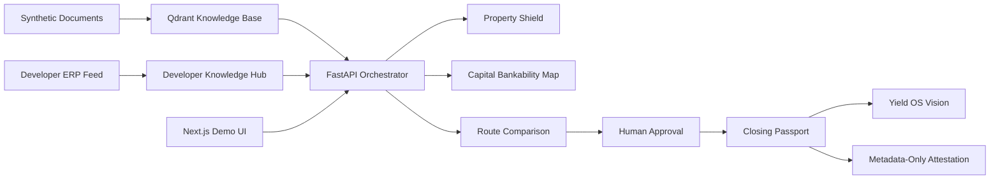
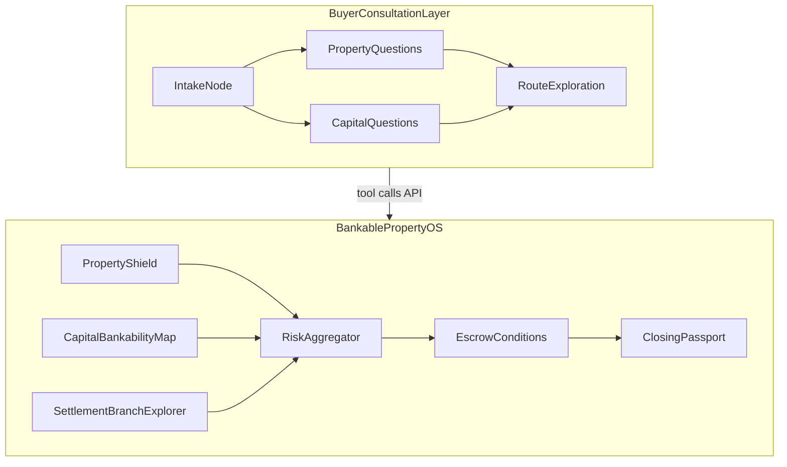

# Architecture

## Controlled Environment Thesis

Bankable Property Network is designed as bank-led trusted settlement infrastructure. Bankable Property OS is the operating layer that can run in a controlled environment. The demo uses local or private services for retrieval, ranking, and generation instead of requiring sensitive buyer or transaction data to leave the bank boundary.

## Components

- `apps/web`: Next.js demo UI — Pitch Screen, **Supplier Contrast**, Developer Knowledge Hub, Settlement Flow panel, Yield Plan, Guided Simulation, Scenario Simulator.
- `apps/api`: FastAPI backend for Developer Knowledge Hub, Property Shield, Capital Bankability Map, route comparison, human approval, and evidence pack generation.
- `apps/buyer-agent` (roadmap): LangGraph.js buyer consultation service — nonlinear discovery layer; calls API as policy-controlled tools.
- `data/synthetic`: synthetic property, developer, policy, and settlement documents used for the demo knowledge base.
- `infra/docker-compose.yml`: local Qdrant vector database for RAG.
- `config/default.yaml`: source-controlled non-secret configuration.

## Data Flow

## Agent Layers

Two orchestration layers — see [`NONLINEAR_DECISION_GRAPH.md`](NONLINEAR_DECISION_GRAPH.md) and [`BUYER_CONSULTATION_AGENT.md`](BUYER_CONSULTATION_AGENT.md):

Runtime: **LangGraph.js** (primary). Stack evaluation: [`AGENT_STACK_EVALUATION.md`](AGENT_STACK_EVALUATION.md).

## AI As Operational Scaling Layer

AI is not an optional hackathon add-on. It is how Bankable Property OS scales verification and evidence review in a controlled environment.

| Component | Role in money OS |
|-----------|------------------|
| Deterministic rules | Policy engine: capital and route decisions |
| LangGraph.js orchestration | Nonlinear buyer consultation + settlement branch graph |
| BGE embeddings + Qdrant | Machine-readable knowledge base: policies, developers, agents, settlement rules |
| Reranker | Precision evidence for compliance officers |
| Schema-bound LLM instruct | Explainability: counter-offer memos, compliance summaries — not autonomous decisions |
| Explicit fallback | No silent degradation when AI services are unavailable |

Pitch line:

> AI does not decide whether money moves. AI helps regulated structures review evidence faster, at scale, with traceability.

The MVP runs on deterministic rules first. Live RAG/LLM integrations demonstrate the production scaling path. See `docs/REAL_RAG_DEMO.md`, `docs/LOCAL_AI_CONTOUR.md`, `docs/AI_SERVICE_TIERS.md`, and `docs/MONEY_INFRASTRUCTURE_THESIS.md`.

## AI Services (Demo vs Production)

| Component | Demo / local | Production / scale |
|-----------|--------------|-------------------|
| LLM instruct | LM Studio (`:1234/v1`) — optional explainability | **vLLM** gateway — multi-tenant GPU, auth, SLA |
| Embeddings | BGE-M3 (`:9001`) | **Qwen3-Embedding** / Qwen-class or enterprise API |
| Reranker | bge-reranker-v2-m3 (`:9002`) | Dedicated rerank cluster |
| Vector DB | Qdrant Docker (`:6333`) | Managed Qdrant / hybrid search |
| Agent orchestration | LangGraph.js local (`apps/buyer-agent`) | Managed graph runtime + vLLM-backed LLM nodes |

See `docs/AI_SERVICE_TIERS.md` for rationale and env placeholders.

## AI Services (Implementation)

- Embedding service indexes synthetic policy, developer, risk case, and settlement documents.
- Reranker improves retrieval relevance for the evidence pack.
- LLM service generates explainable summaries, bank counter-offers, and compliance memo drafts.

## Privacy Position

The system never writes passports, contracts, bank statements, or personal buyer data to chain. The Closing Passport stores status metadata and a deterministic evidence pack hash.

## MVP Boundary

The hackathon slice remains narrow: foreign buyer, Dubai bank funds, USDT holdings, risky Thai condo deposit, FET-ready Thai bank route, escrow conditions, and Closing Passport. Multi-bank network, verified participants, and post-purchase finance are roadmap layers.
