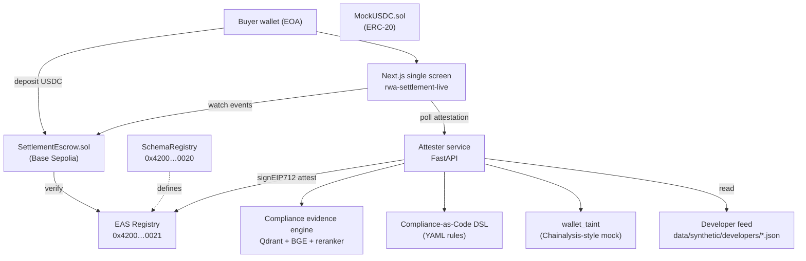

# Architecture — AttestRWA

## High-level



## Layers

### 1. On-chain layer

**Network:** Base Sepolia (chainId 84532) for development and hackathon
submission. Production target: Base mainnet (deferred post-hackathon).

**Contracts (deployed in Week 2):**

| Contract | Address | Role |
|----------|---------|------|
| EAS | `0x4200000000000000000000000000000000000021` (canonical) | Attestation registry |
| SchemaRegistry | `0x4200000000000000000000000000000000000020` (canonical) | Schema definitions |
| SettlementApproval Schema | UID `0x1f64ec96216b0381dc4443b7378c57485f2217656537e8ea36f0b23af047cc96` | 10-field deal attestation |
| SettlementEscrow.sol | _(deploy Week 2)_ | Holds stablecoin, releases on valid attestation |
| MockUSDC.sol | _(deploy Week 2)_ | Demo ERC-20 stablecoin (mint to anyone for testing) |

See [`ATTESTATION_SCHEMA.md`](ATTESTATION_SCHEMA.md) for full schema.

### 2. Attester service (off-chain)

**Stack:** Python 3.12 + FastAPI + uv + Pydantic.

**Modules (Week 2):**

| Module | Responsibility |
|--------|----------------|
| `attester_service.py` | Orchestrates verification + signs attestation |
| `eas_client.py` | EAS SDK wrapper (sign EIP-712, push to EAS) |
| `wallet_taint.py` | Wallet history classification: green / amber / red (mock Chainalysis-style signals) |
| `compliance_dsl.py` | YAML rule parser → attestation requirements |
| `closing_passport_demo.py` (existing) | Property Shield + capital map (legacy logic, repurposed) |
| `developer_knowledge.py` (existing) | Upstream developer feed lookup |
| `rag.py` (existing, renamed role) | Compliance evidence retrieval via Qdrant + BGE + reranker |

**Endpoints (Week 2):**

| Method | Path | Returns |
|--------|------|---------|
| `POST` | `/attest/settlement` | Decision + EAS attestation UID |
| `GET` | `/attest/{dealId}` | Attestation status + evidence pack hash |
| `GET` | `/attest/healthz` | Attester service readiness |

### 3. Compliance evidence engine

**Stack:** Qdrant vector DB + BGE-M3 embeddings + BGE reranker + (optional)
LM Studio for explainability prose. Same engine that powered the legacy
v0.5 RAG pipeline; repurposed in v1 to support attester decisions.

**Corpus:** synthetic JSON + markdown under `data/synthetic/` — developer
feeds, scenario definitions, policy documents, settlement rules.

**Use:** at attestation time, the attester service retrieves the top
relevant policy + developer-feed + scenario snippets and includes their
hash in the EAS `evidenceHash` field. The full pack stays off-chain
(privacy-safe), but its hash is on-chain (audit-safe).

### 4. Frontend layer (Week 2)

**Stack:** Next.js + TypeScript + pnpm + wagmi + viem + RainbowKit.

**Pages:**

| Path | Role |
|------|------|
| `/` (single screen) | Wallet connect → deposit → watch attester → see EAS attestation appear → escrow releases or refunds |
| `/api/frame/attest` (Week 3) | Farcaster Frame endpoint — Frame action shows attestation status |

No multi-page dashboards. The whole demo is one screen with a 90-second
arc.

### 5. Dev / production deployment

```mermaid
flowchart LR
  subgraph local [Local dev (Week 1-2)]
    anvil["Anvil fork of Base Sepolia"]
    devApi["FastAPI :8080"]
    devWeb["Next.js :3000"]
  end

  subgraph testnet [Real Base Sepolia (Week 3)]
    base["Base Sepolia mainnet RPC"]
    prodApi["FastAPI on Render / Railway"]
    prodWeb["Next.js on Vercel"]
    dune["Dune dashboard"]
    farc["Farcaster Frame"]
  end

  anvil -.->|switch by env var| base
  devApi -.->|deploy| prodApi
  devWeb -.->|deploy| prodWeb
  prodWeb --> farc
  base --> dune
```

Switching dev → real testnet is a single environment-variable flip
(`DEV_RPC_URL=http://127.0.0.1:8545` → `https://sepolia.base.org`), plus
one optional 60-second faucet step. See [`DEV_SIMULATION.md`](DEV_SIMULATION.md)
for the runbook.

## Data flow — happy path (deal_id 0xABCD)

1. **Buyer wallet** approves Mock USDC transfer to `SettlementEscrow`.
2. **Buyer wallet** calls `escrow.deposit(dealId, payeeAddress, amount,
   tokenAddress)`.
3. **Escrow contract** holds funds; emits `Deposited(dealId, ...)` event.
4. **Attester service** observes the event (or receives explicit
   `POST /attest/settlement` request).
5. **Attester service** runs verification:
   a. Look up `dealId` → property + payeeAddress.
   b. Query developer feed: is `payeeAddress` in
      `developer.authorizedPayees[]`? → `payeeVerified = true|false`.
   c. Run wallet_taint on buyer EOA → `capitalClass = green | amber | red`.
   d. Run compliance DSL rules → `decision = approve | reject | escalate`.
   e. Retrieve RAG evidence → compute `evidenceHash = keccak256(pack)`.
6. **Attester service** signs EAS attestation off-chain (EIP-712), then
   calls `eas.attest(schemaUid, {recipient, data, ...})`.
7. **Escrow contract** picks up the attestation UID (via `release()` call
   from buyer or attester) and verifies:
   a. `attestation.schema == SettlementApproval`
   b. `attestation.revocationTime == 0`
   c. `attestation.expirationTime > block.timestamp`
   d. `attDealId == localDealId`
   e. `attester in trustedAttesters`
   f. `payeeVerified == true`
   g. `capitalClass < 2` (green or amber)
8. **Escrow contract** transfers USDC to `payeeAddress`; emits
   `SettlementReleased(dealId, payeeAddress, amount, attestationUid)`.
9. **Frontend** observes the release event; shows BaseScan link + EAS Scan
   link + Closing Passport hash.

## Reject path

Same as steps 1–5; at step 5d the decision is `reject`. The attester signs
a **revocable** attestation with `payeeVerified = false` (or `capitalClass
= red`). At step 7, `release()` fails the requirement check. Funds remain
escrowed; after `expiresAt`, the buyer calls `escrow.refund(dealId)` and
gets their USDC back. All branches logged on-chain.

## Key design decisions

- **Forked dev chain, not mocked EAS.** Anvil forks Base Sepolia, so the
  EAS protocol bytecode at `0x4200…0021` is the real production code. We
  do not mock the attestation protocol, which would risk semantic drift.
- **Mock USDC, not real testnet USDC.** Demo determinism > realism for a
  3-minute jury demo. We can mint any amount on demand. Production deploy
  would point to real USDC.
- **Revocable attestations.** If an attester signs by mistake (or is
  compromised), they can revoke; escrow re-checks `revocationTime == 0`
  before release.
- **Public attester address.** Anyone can verify attestations on EAS Scan
  without our cooperation. This is intentional (composable trust).
- **Off-chain evidence pack, on-chain hash.** Privacy-safe; auditable.
- **No upgradeable contracts.** Escrow is immutable. Schema is immutable
  by EAS design. Migration = new contract, new schema, deprecation period.
