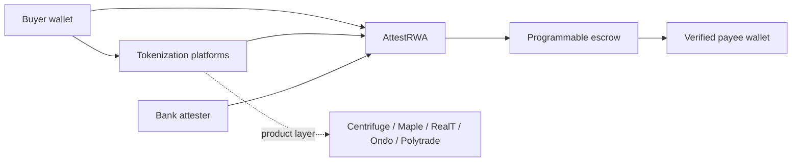

# Comparison — AttestRWA vs the RWA stack

AttestRWA is positioned as a **compliance primitive** that other RWA
projects plug into. We deliberately do not compete on tokenization,
custody, KYC, or yield. This page makes that positioning concrete.

## At a glance

| Capability | AttestRWA | Centrifuge | Maple | RealT | Ondo | Polytrade |
|------------|-----------|------------|-------|-------|------|-----------|
| Asset tokenization | not built | core | core | core | core | core |
| Programmable compliance bridge | **core** | partial (per-pool) | partial (per-pool) | not built | partial (KYC list) | partial |
| Bank-attester model | **core** | not native | not native | not native | not native | not native |
| Public on-chain schema for settlement decisions | **yes (EAS)** | proprietary | proprietary | proprietary | proprietary | proprietary |
| Schema re-usable by any chain consumer | **yes** | no | no | no | no | no |
| KYC providers built in-house | no (integrates) | partial | partial | yes | no | partial |
| Stablecoin settlement (USDC/USDT) | **yes (escrow contract)** | yes | yes | partial | yes | yes |
| Property / RWA tokenized in our system | no, by design | yes | partial | yes | yes (T-bills + RWA) | yes |
| Open source | **Apache-2.0** | Apache-2.0 | proprietary | proprietary | mixed | proprietary |
| Slither-clean code at hackathon stage | **yes (0 findings)** | n/a (audited) | n/a (audited) | n/a | n/a | n/a |

## Where each project sits in the value chain

In one line: **tokenization platforms** answer "is the asset on-chain?";
**AttestRWA** answers "is moving stablecoin to a counterparty bank-grade?".

## How a tokenization platform integrates AttestRWA

The integration is read-only on AttestRWA's side. The platform:

1. Computes a deterministic `dealId` from its own pool / vault state.
2. Asks AttestRWA's attester (off-chain) for a `SettlementApproval` decision.
3. Reads the resulting EAS attestation on-chain and gates its own
   settlement transaction on `payeeVerified == true` and `capitalClass < 2`.

No fork of AttestRWA contracts is needed; the EAS schema is canonical and
publicly resolvable.

## How a bank integrates AttestRWA

The bank becomes the **attester**:

1. Operates a hosted FastAPI attester service (same code as in
   `apps/api/`) with its production compliance policy under
   `data/policies/`.
2. Uses an HSM-backed EOA registered in `SettlementEscrow.trustedAttesters`
   on every chain it supports.
3. Earns a fee per attestation, on top of its existing custody / FET /
   escrow revenue lines.

The bank's compliance policy is **its own YAML rule pack**; AttestRWA
provides the engine and the on-chain primitive, not the policy content.

## Honest where we are weaker (today)

- **No production audit.** We have Foundry tests, fuzz, and a clean
  Slither pass — that is not an audit. Production blockers in
  `docs/SECURITY.md` apply.
- **Mock wallet taint.** Production needs Chainalysis / TRM Labs.
- **Single attester whitelist.** Multi-attester registry is roadmap.
- **No HSM yet.** Production attester keys must live in an HSM, not
  `.env`.
- **No multi-token support.** Mock USDC only; production deploy points
  to canonical USDC and adds USDT/EURC alongside.
- **No mainnet.** Base Sepolia testnet only at hackathon stage.

## Why this still wins on the merits

- **Composable.** Public EAS schema means any chain consumer — DeFi
  protocol, exchange, custodian — can verify an AttestRWA attestation
  without any bilateral integration.
- **Hard to copy without a bank.** The primitive lives or dies on
  attester reputation. Tokenization platforms have no incentive to
  operate their own attester; banks do.
- **Open source.** Apache-2.0 + public schema + public attester address
  = forkable, auditable, no rent-seeking moat.
- **Real engineering bar.** 95 / 95 green tests, slither clean, fuzz
  invariants, complete e2e flow — at hackathon stage. Most RWA
  competitors at this stage are still slide decks.

## References

- Centrifuge: <https://centrifuge.io>
- Maple Finance: <https://maple.finance>
- RealT: <https://realt.co>
- Ondo Finance: <https://ondo.finance>
- Polytrade: <https://www.polytrade.finance>
- Ethereum Attestation Service: <https://attest.org>
- Base: <https://base.org>
