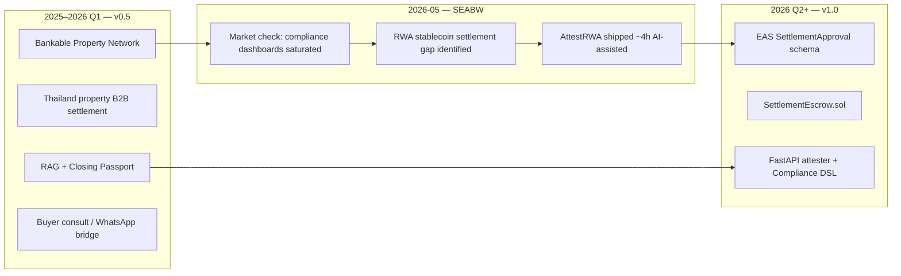

# Pivot — Bankable Property Network → AttestRWA

Visual timeline for contributors landing in one repo with two generations.

## Timeline



## What moved where

| v0.5 asset (`archive/v0.5/`) | v1 role |
|------------------------------|---------|
| Payee mismatch detection | Core reject-path demo |
| Capital classification (green/amber/red) | `capitalClass` in EAS schema |
| RAG (Qdrant + BGE) | Compliance evidence engine |
| Closing Passport model | `SettlementApproval` EAS fields |
| Synthetic developer feeds | Attester input SSOT |
| Buyer consult / 8 UI panels | **Archived** — not maintained |

## Tags

| Tag | Meaning |
|-----|---------|
| `v0.5.13` | Last Bankable Property Network release before pivot |
| `v1.0.0` | First AttestRWA hackathon release |

Explore v0.5:

```bash
git checkout v0.5.13
```

Return to AttestRWA:

```bash
git checkout main
```

## Naming

Public brand: **AttestRWA**. Repository: **[FUYOH666/attestrwa](https://github.com/FUYOH666/attestrwa)**.

Historical name `bankable-property-network` redirects to `attestrwa` on GitHub.
