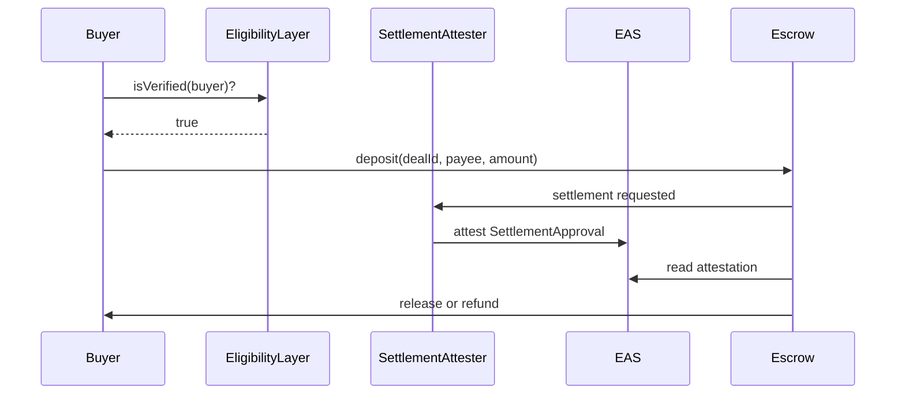

# RFC-0001: Settlement + Eligibility Composition

| Field | Value |
|-------|-------|
| Status | Draft |
| Author | AttestRWA / Aleksandr Mordvinov |
| Created | 2026-05-31 |
| Target chains | Base Sepolia → Base mainnet |
| Related | Shibui (EEA), Coinbase Verifications, AttestRWA |

## Summary

Define a **composable two-layer attestation model** for RWA stablecoin
settlement:

1. **Eligibility layer** — Is the wallet permitted to participate? (Shibui /
   ERC-3643 / Coinbase verification)
2. **Settlement layer** — Is this specific deal's payee and evidence
   bank-grade? (AttestRWA `SettlementApproval`)

Neither layer replaces the other. Escrow or transfer hooks may require **both**.

## Motivation

2026 RWA stacks solve tokenization but leave a gap at **settlement**: buyers
wire stablecoins to payees without a public, composable verification primitive.
Parallel work on EAS + ERC-3643 (Shibui) solves **holder eligibility**, not
**payee authority** or **deal evidence**.

Composition avoids rebuilding KYC while adding bank-grade settlement signals.

## Definitions

| Term | Meaning |
|------|---------|
| `EligibilityAttestation` | EAS attestation proving wallet passes policy topics (KYC, jurisdiction, etc.) |
| `SettlementApproval` | AttestRWA schema — dealId, payeeVerified, capitalClass, evidenceHash, … |
| `Consumer` | Contract or off-chain service gating movement of funds |

## Architecture



## Interface (normative sketch)

### Eligibility check (Shibui-compatible)

```solidity
interface IEligibilityVerifier {
    function isVerified(address wallet) external view returns (bool);
}
```

### Settlement check (AttestRWA)

```solidity
interface ISettlementAttestationReader {
    function isSettlementApproved(
        bytes32 dealId,
        address payee,
        bytes32 attestationUid
    ) external view returns (bool);
}
```

### Composed gate

```solidity
function canRelease(
    address buyer,
    bytes32 dealId,
    address payee,
    bytes32 settlementUid
) internal view returns (bool) {
    return eligibility.isVerified(buyer)
        && settlement.isSettlementApproved(dealId, payee, settlementUid);
}
```

## Schema reference

AttestRWA `SettlementApproval` — see [`ATTESTATION_SCHEMA.md`](../ATTESTATION_SCHEMA.md).

Shibui topics — see [EEA Shibui docs](https://entethalliance.github.io/rnd-rwa-erc3643-eas/).

## Security considerations

- **Independent attesters** — eligibility provider ≠ settlement attester
- **Revocation** — both layers must check `revocationTime == 0`
- **Expiry** — settlement attestations should be time-bound per deal
- **Evidence** — full pack off-chain; `evidenceHash` on-chain only

## Reference implementation

- AttestRWA: [FUYOH666/attestrwa](https://github.com/FUYOH666/attestrwa)
- Shibui: [EntEthAlliance/rnd-rwa-erc3643-eas](https://github.com/EntEthAlliance/rnd-rwa-erc3643-eas)
- Example hook: [`examples/integrate-centrifuge-hook/`](../examples/integrate-centrifuge-hook/README.md)

## Open questions

1. Should Shibui register a dedicated **settlement topic** or stay wallet-only?
2. Standard ABI for `evidenceHash` verification off-chain?
3. PayingResolver fee split between eligibility and settlement attesters?

## Changelog

- 2026-05-31: Initial draft for ecosystem outreach
