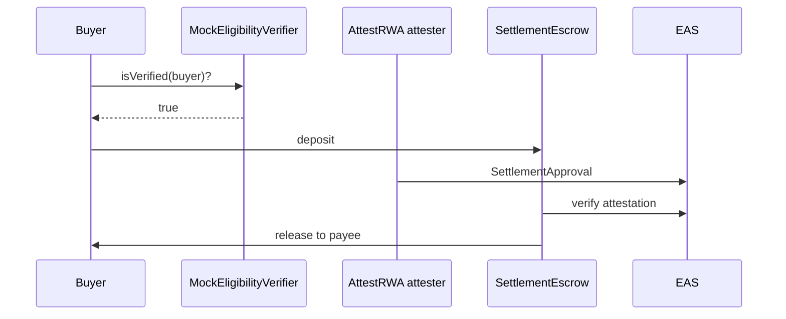

# Composed eligibility + settlement (mock)

Demonstrates RFC-0001 without depending on the Shibui repository. Swap
`MockEligibilityVerifier` for Shibui `EASClaimVerifier` in production.

## Flow



## Interface

```solidity
// SPDX-License-Identifier: Apache-2.0
pragma solidity ^0.8.26;

/// @notice Minimal eligibility gate — production: Shibui EASClaimVerifier.
interface IEligibilityVerifier {
    function isVerified(address wallet) external view returns (bool);
}

/// @dev Demo: always returns true for non-zero wallets.
contract MockEligibilityVerifier is IEligibilityVerifier {
    function isVerified(address wallet) external pure returns (bool) {
        return wallet != address(0);
    }
}
```

Save as `MockEligibilityVerifier.sol` when porting to Foundry; this folder
documents the pattern only.

## Run

```bash
./scripts/demo-composed-flow.sh
```

Runs eligibility mock check, then the standard happy-path E2E.

## References

- [`docs/rfc/0001-settlement-eligibility-composition.md`](../../docs/rfc/0001-settlement-eligibility-composition.md)
- [Shibui](https://github.com/EntEthAlliance/rnd-rwa-erc3643-eas)
- [`docs/LAYERED_TRUST.md`](../../docs/LAYERED_TRUST.md)
