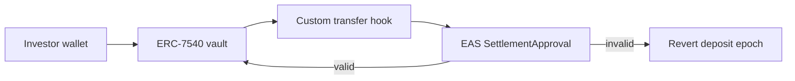

# Centrifuge transfer hook — EAS SettlementApproval (cookbook)

Read-only integration pattern: Centrifuge share token or vault logic **reads**
an AttestRWA EAS attestation before allowing stablecoin settlement. No fork of
Centrifuge protocol required.

**Status:** Cookbook / pseudocode — not a production deployment.

## Prerequisites

- Centrifuge pool with pluggable [transfer hook](https://docs.centrifuge.io/developer/protocol/features/token-compliance/)
- EAS deployed on same chain (Base: `0x4200000000000000000000000000000000000021`)
- Registered `SettlementApproval` schema — see [`docs/ATTESTATION_SCHEMA.md`](../../docs/ATTESTATION_SCHEMA.md)

## Flow



## Interface

```solidity
// SPDX-License-Identifier: Apache-2.0
pragma solidity ^0.8.26;

import { IEAS } from "@eas/IEAS.sol";

/// @notice Minimal reader for AttestRWA SettlementApproval attestations.
/// @dev Decode attestation.data per ATTESTATION_SCHEMA.md in AttestRWA repo.
interface IAttestRWASettlementGate {
    function settlementApproved(
        bytes32 dealId,
        address payee,
        bytes32 attestationUid
    ) external view returns (bool);
}

/// @notice Example hook fragment — adapt to Centrifuge HookManager pattern.
abstract contract CentrifugeSettlementHook {
    IEAS public immutable eas;
    IAttestRWASettlementGate public immutable settlementGate;

    constructor(IEAS eas_, IAttestRWASettlementGate gate_) {
        eas = eas_;
        settlementGate = gate_;
    }

    function _requireSettlement(
        bytes32 dealId,
        address payee,
        bytes32 attestationUid
    ) internal view {
        require(
            settlementGate.settlementApproved(dealId, payee, attestationUid),
            "SETTLEMENT_NOT_APPROVED"
        );
    }
}
```

## Integration steps

1. **Map deal identity** — Derive `dealId = keccak256(abi.encode(poolId, epochId, investor))` or use Centrifuge order ID.
2. **Off-chain attestation** — Bank attester runs AttestRWA FastAPI service; signs EAS attestation after payee + evidence checks.
3. **On-chain gate** — Before epoch settlement, hook calls `settlementApproved`.
4. **Fail closed** — Missing or revoked attestation → deposit/redemption request stays pending or reverts.

## Test vectors

| Case | payeeVerified | capitalClass | Expected |
|------|---------------|--------------|----------|
| Happy | true | green (0) | Pass |
| Payee mismatch | false | green | Fail |
| Red capital | true | red (2) | Fail |
| Revoked UID | — | — | Fail |

Run AttestRWA E2E scripts locally:

```bash
./scripts/e2e_rwa_flow.sh
./scripts/e2e_rwa_reject.sh
```

## References

- [Centrifuge token compliance](https://docs.centrifuge.io/developer/protocol/features/token-compliance/)
- [AttestRWA RFC-0001](../../docs/rfc/0001-settlement-eligibility-composition.md)
- [Centrifuge protocol repo](https://github.com/centrifuge/protocol)

## Outreach

Discussion draft: [`docs/OUTREACH_TARGETS.md`](../../docs/OUTREACH_TARGETS.md) § Target 2.
